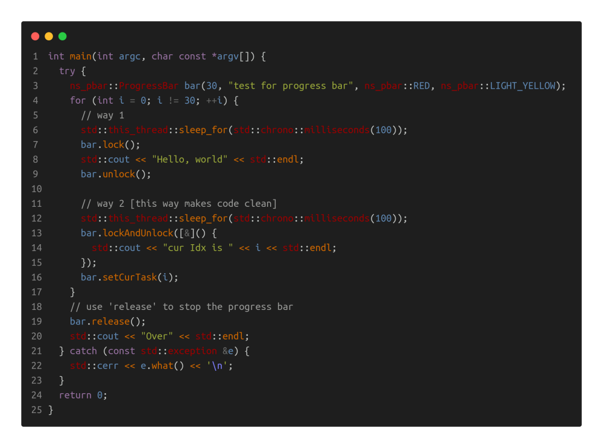
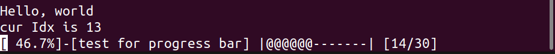
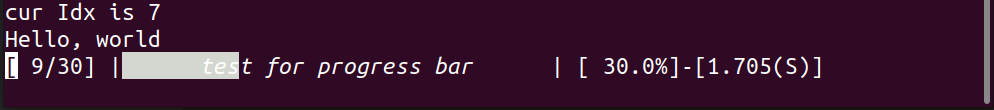
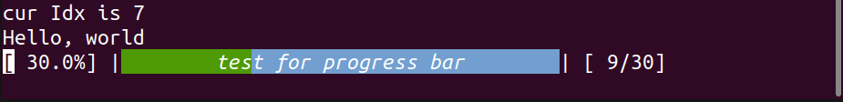

# Progress Bar

**Author: shlChen**

**E-Mail: 3079625093@qq.com**

[TOC]

## 1. Overview

Console is more robust than GUI. How to output effective information on the console is a knowledge. This library provides the function of outputting progress bar information on the console under Linux, which is simple and easy to use.

## 2. Usage

code:



output:








## 3. Apis

the macro below controls the color, if this macro defined, the progress bar will be printed with color.

```cpp
#define PROGRESS_COLOR_BAR
```

```cpp
enum BarColor : int {
    /**
     * @brief options
     */
    NONE = 0,
    BLACK = 40,
    RED,
    GREEN,
    YELLOW,
    BLUE,
    PURPLE,
    PEACOCK_BLUE,
    WHITE,
    LIGHT_BLACK = 100,
    LIGHT_RED,
    LIGHT_GREEN,
    LIGHT_YELLOW,
    LIGHT_BLUE,
    LIGHT_PURPLE,
    LIGHT_PEACOCK_BLUE,
    LIGHT_WHITE
  };
```

```cpp
/**
 * @brief Construct a new Progress Bar object
 */
ProgressBar(std::size_t taskCount, const std::string &desc = "New Task", BarColor fillColor = BarColor::WHITE, BarColor emptyColor = BarColor::NONE, std::ostream &os = std::clog);
```

```cpp
/**
 * @brief get the task count for the progress bar
 */
std::size_t taskCount() const;
```

```cpp
/**
 * @brief print next progress bar, it's called when a task is done usually
 */
ProgressBar &show(std::size_t idx);
```

```cpp
/**
 * @brief clear the progress bar
 */
ProgressBar &clear();
```

```cpp
/**
 * @brief update the progress bar
 *
 * @param idx the index of the task
 * @param fun the function to
 * @return ProgressBar&
 */
ProgressBar &update(std::size_t idx, const std::function<void()> &fun);
```

```cpp
/**
 * @brief release the progress bar, which means subsequent messages will be printed below the progress bar
 */
ProgressBar &release();
```

